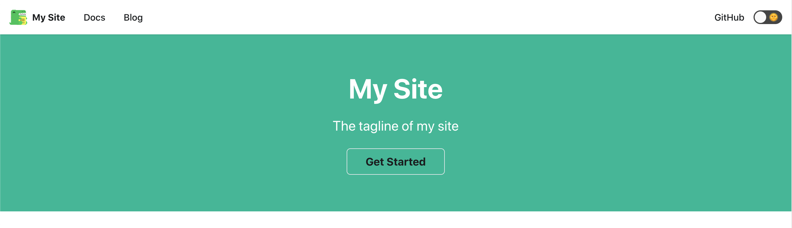

サンプルサイトが立ち上がったあと、自分で作りたいサイトにカスタマイズしていきましょう。

## サイトの構成ファイル

デフォルトの構成データは以下のファイルに記載されています。

- `docusaurus.config.js`

実際のトップページのデザインを定義しているファイルは、`src/pages/index.js` を利用しており、コードを参照すると `docusaurus.config.js` ファイルの値を利用していることがわかります。一部をピックアップすると、例えば tagline に関して `docusaurus.config.js` のファイルの中には以下のように記載されています。

```json
title: 'My Site',
tagline: 'The tagline of my site',
url: 'https://your-docusaurus-test-site.com',
baseUrl: '/',
onBrokenLinks: 'throw',
favicon: 'img/favicon.ico',
organizationName: 'facebook', // Usually your GitHub org/user name.
projectName: 'docusaurus', // Usually your repo name.
```

この定義を、`src/pages/index.js` ファイルでは *siteConfig.tagline* を呼び出して、指定した値をページに表示しています。

```javascript
<Layout
  title={`Hello from ${siteConfig.title}`}
  description="Description will go into a meta tag in <head />">
  <header className={clsx('hero hero--primary', styles.heroBanner)}>
    <div className="container">
      <h1 className="hero__title">{siteConfig.title}</h1>
      <p className="hero__subtitle">{siteConfig.tagline}</p>
      <div className={styles.buttons}>
        <Link
          className={clsx(
            'button button--outline button--secondary button--lg',
            styles.getStarted,
          )}
          to={useBaseUrl('docs/')}>
          Get Started
        </Link>
      </div>
    </div>
  </header>
  <main>
    {features && features.length > 0 && (
      <section className={styles.features}>
        <div className="container">
          <div className="row">
            {features.map((props, idx) => (
              <Feature key={idx} {...props} />
            ))}
          </div>
        </div>
      </section>
    )}
  </main>
</Layout>
```

実際に表示されているホームページのタグラインは以下のようになります。



## サイト構成

標準で提供されている主な値は以下の通りです。値は拡張することができ、また `src/pages/index.js` に要素を追加することで、ページの要素として利用できます。

| パラメーター     | 値                                |
|------------------|-----------------------------------|
| title            | サイトの名前                      |
| tagline          | タグライン                        |
| url              | サイトの URL                      |
| baseUrl          | ベースの URL （デフォルトでは / ) |
| favicon          | favicon.ico を指定                |
| organizationName | 組織名                            |
| projectName      | プロジェクト名                    |

### themeConfig

この項目では、テーマに関する設定を入力していくことになります。

#### navbar

navbar の項目に関しては、ナビゲーションバーの項目を設定していきます。

| パラメーター | 値                                   |
|--------------|--------------------------------------|
| title        | サイトのタイトル名                   |
| logo         | 左上に表示されるロゴ                 |
| items        | ナビゲーションに配置するメニュー項目 |

```javascript
navbar: {
  title: '原水商店',
  logo: {
    alt: '原水商店',
    src: 'img/logo.svg',
  },
  items: [
    {
      to: 'docs/',
      activeBasePath: 'docs',
      label: '技術メモ',
      position: 'left',
    },
    {to: 'blog', label: 'ブログ', position: 'left'},
    {
      href: 'https://github.com/haramizu/haramizu.com',
      label: 'GitHub',
      position: 'right',
    },
  ],
},
```

#### footer

フッターエリアに並べられているアイテムの設定をしています。
これらの項目は `src/pages/index.js` で定義されているデータを入力しているだけとなりますので、サンプルのコードはそちらと合わせて確認してください。

### presets

これは、各ページの GitHub で展開しているコードをそのまま参照できるようにする機能です。自分がアップしている GitHub のリポジトリの URL を指定しましょう。