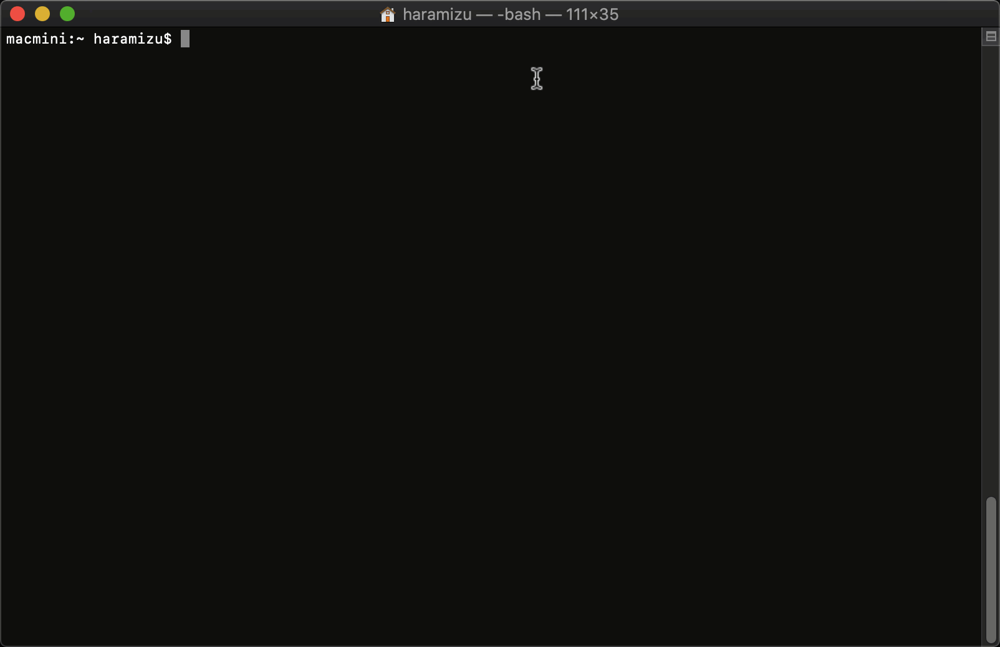

Docusaurus は Facebook が提供しているドキュメント生成ツールで、マニュアルなどのドキュメントサイトを構築するなどの際に利用されていますDocusaurus の正式リリース版は v1 が提供されており、v2 が開発中という形で提供されています。

この文書では Docusaurus のバージョン 2 （利用開始の段階ではα版）を利用してメモをまとめています。このため、正式リリースでは利用方法などが変わる点が出てくる可能性があります。気づいたときに更新するようにしますが、参照時ではその点をあらかじめご了承ください。

## Docusaurus とは？

Docusaurus は静的サイト生成ツールとして提供されており、文書の公開、ブログの公開をマークダウンを利用して素早く作ることができる。またコンテンツ作成に関しては、Markdown を利用してページが生成されるようになります。v2 では React を利用することがでっ切るようになっています。

## 機能について

Docusaurus v2 は以下の機能が実装されるように開発が進められています。

- React を利用して拡張とカスタマイズ
- 基本的なテンプレートとして Bootstrap を利用できます
- コードとデータの分離（ v1 では website などのフォルダがありましたが、ルートで作業ができます）
- GitHub ページ、Netlify などのサービスに簡単に展開ができる

追加の機能としては以下のようなものが実装されています。

- SEO 対応
  - HTML ファイルを指定したパスに生成します
- MDX の活用
  - Markdown に埋め込まれた JSX や React を利用したインタラクティブなコンテンツ

今後、ローカリゼーションに関しての機能も強化される予定です。

## インストール

インストールに関して、簡単にインストールをすることができます。以下の手順を確認してください。

### 必要システム

- Node.js バージョン 10.15.1 以上
- Yarn バージョン 1.5 以上 
  - Yarn は JavaScript 用のパッケージマネージャーで、npm クライアントの代わりに利用できます

### プロジェクトのサイトを作成

コマンドラインで以下のように記載してください。

```
npx @docusaurus/init@next init [name] [template]
```

name は作成するプロジェクトのディレクトリ、template にはテンプレート名を指定します。私は以下のように実行しました。

```
npx @docusaurus/init@next init haramizu.com classic
```



テンプレートに関してはいくつか用意されていますが、今回は classic を指定しました。

## アップデートに関して

バージョンの確認をするためのコマンドは以下の通りです。

```
npx docusaurus --version
```

この情報は、利用している環境の `package.json` のファイルを参照することで、現在利用しているバージョンを確認することができます。

```json
  "dependencies": {
    "@docusaurus/core": "2.0.0-alpha.64",
    "@docusaurus/preset-classic": "2.0.0-alpha.64",
    "@mdx-js/react": "^1.5.8",
    "clsx": "^1.1.1",
    "react": "^16.8.4",
    "react-dom": "^16.8.4"
  },
```

アップデートに関しては以下のコマンドを実行してください。

```
yarn upgrade @docusaurus/core@next @docusaurus/preset-classic@next
```

実行結果は以下のようになります。

```
macmini:haramizu.com haramizu$ yarn upgrade @docusaurus/core@next @docusaurus/preset-classic@next
yarn upgrade v1.22.4
warning package-lock.json found. Your project contains lock files generated by tools other than Yarn. It is advised not to mix package managers in order to avoid resolution inconsistencies caused by unsynchronized lock files. To clear this warning, remove package-lock.json.
[1/4] 🔍  Resolving packages...
[2/4] 🚚  Fetching packages...
[3/4] 🔗  Linking dependencies...
[4/4] 🔨  Rebuilding all packages...
success Saved lockfile.
success Saved 8 new dependencies.
info Direct dependencies
└─ @docusaurus/preset-classic@2.0.0-alpha.65
info All dependencies
├─ @docusaurus/plugin-debug@2.0.0-alpha.65
├─ @docusaurus/plugin-google-analytics@2.0.0-alpha.65
├─ @docusaurus/plugin-google-gtag@2.0.0-alpha.65
├─ @docusaurus/plugin-sitemap@2.0.0-alpha.65
├─ @docusaurus/preset-classic@2.0.0-alpha.65
├─ @docusaurus/theme-classic@2.0.0-alpha.65
├─ @docusaurus/theme-search-algolia@2.0.0-alpha.65
└─ infima@0.2.0-alpha.13
✨  Done in 22.21s.
macmini:haramizu.com haramizu$ 
```

package.json ファイルに関して、今回の実行で以下のようになりました。

```json
  "dependencies": {
    "@docusaurus/core": "^2.0.0-alpha.65",
    "@docusaurus/preset-classic": "^2.0.0-alpha.65",
    "@mdx-js/react": "^1.5.8",
    "clsx": "^1.1.1",
    "react": "^16.8.4",
    "react-dom": "^16.8.4"
  },
```

随時最新版にして検証、気づいた点があればフィードバックできるようにしておきましょう。
## 参考ページ

* [Installation](https://v2.docusaurus.io/docs/installation/)