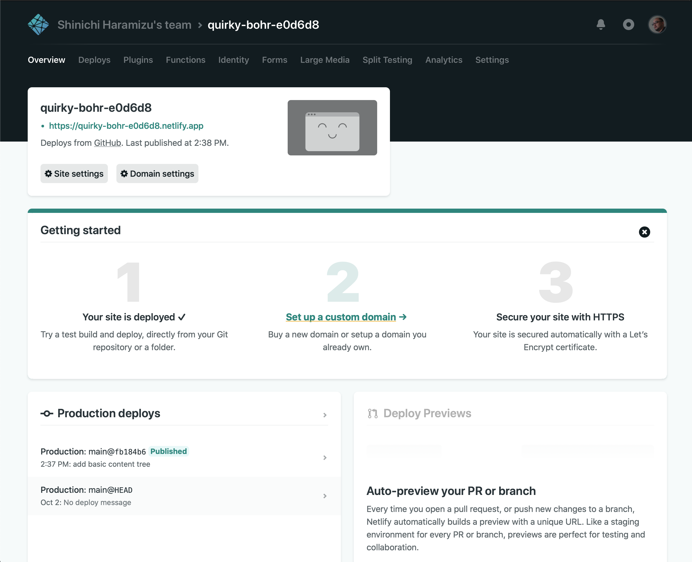
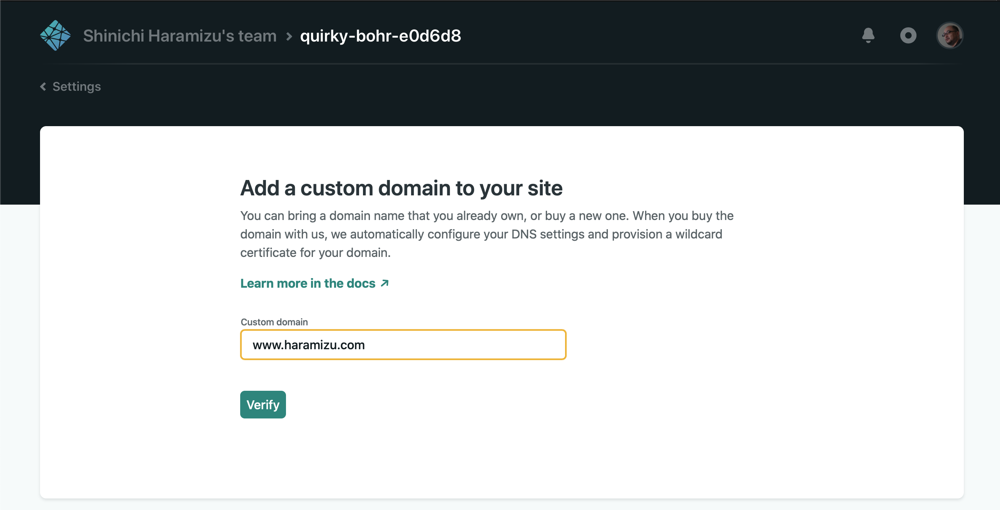
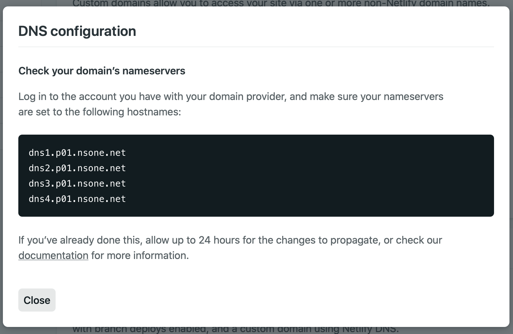
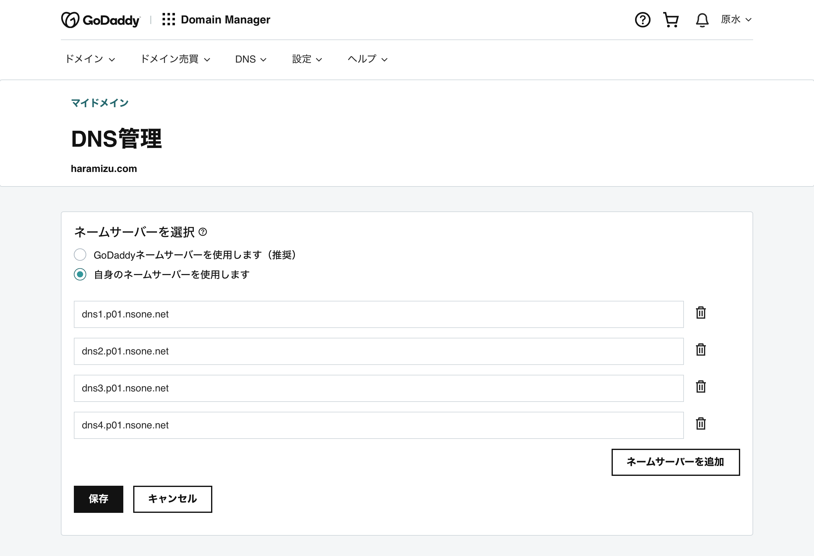
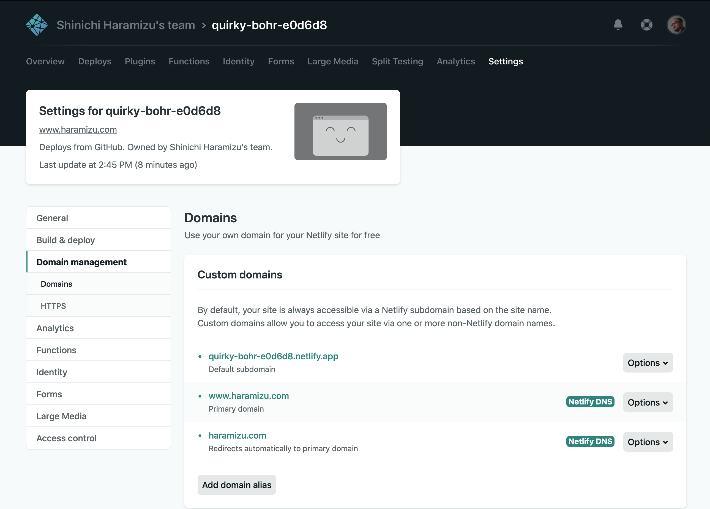
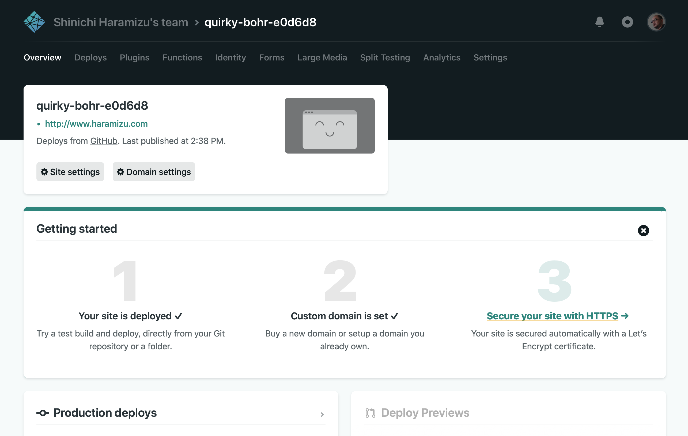
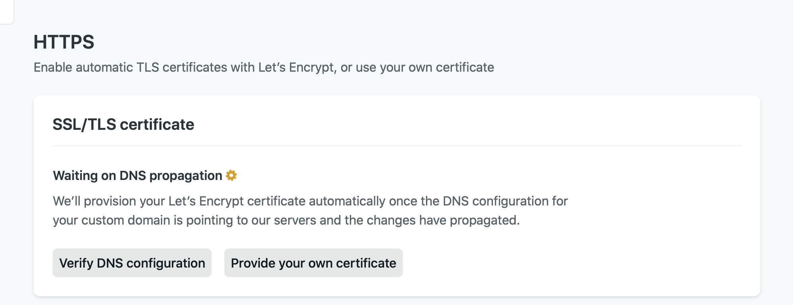
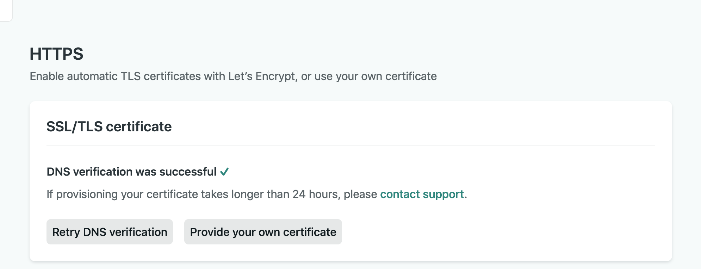
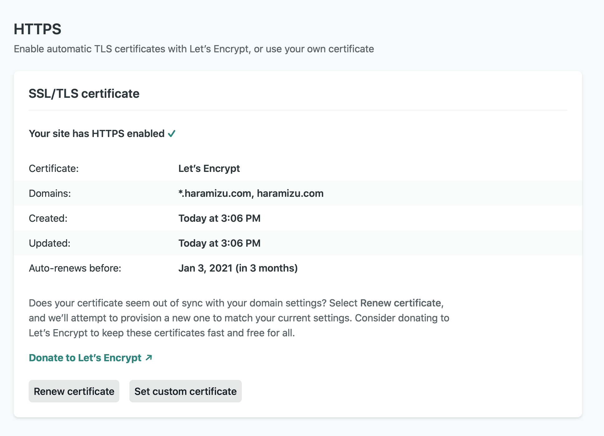
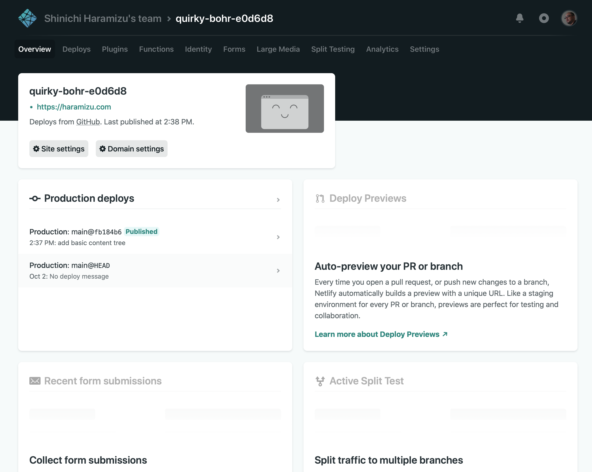

Netlify で立ち上げたサイトに、独自ドメインを割り当てる方法について、このページでは紹介をします。ドメインの設定に関してある程度知識がある人であればスムーズに進めることができます。手順としては、DNS のサーバーを Netlify に変更してあとはお任せ、という感じの設定にしました。

## ドメインの設定に関して

### DNS サーバーの設定


### DNS サーバーごと移管

サイトを立ち上げると、新しく作成したサイトの Overview の画面に、*Set up a custom domain* というメニューが表示されているのがわかります。



クリックをすると、ドメイン名を入力するだけの入力ボックスが表示されます。自分の持っているドメイン名を指定しましょう。



すでに自分で持っているドメイン名なので、確認の画面では *Yes, add domain* を指定して次に進みます。


すると Custom Domains の画面で、黄色いアラートと合わせて Check DNS configuration という表示されているのがわかるかと思います。


Check DNS Configuration をクリックすると、以下のような DNS の設定に関する画面が表示されます。



DNS サーバーを別のものに切り替えましょう、ということですね。以下の 4 つのサーバーを指定しておきます。

```
dns1.p01.nsone.net
dns2.p01.nsone.net
dns3.p01.nsone.net
dns4.p01.nsone.net
```

私はドメインの管理として GoDaddy を利用しているので、ドメインマネージャーを立ち上げて、DNS サーバーの設定を変更しました。変更は比較的早く反映されました。



変更が確認できると、以下のように *Netlify DNS* という表示とともに、緑色で正しく動いているのを確認することができます。



## 証明書を更新する

独自ドメインの設定をしたのであれば、証明書に関しても合わせて登録をしましょう。



証明書を持っている場合は、証明書をアップロードしてその証明書を利用することができます。 *Provide your own certificate* をクリックしてアップロードすれば、設定した証明書がアップロードされる形です。証明書を持っていなくても大丈夫です、Let's Encrypt のサービスと連携していて、無料で証明書を利用することも可能になっています。その場合は、Verify DNS configuration のボタンを押すだけで完了です。



しばらくすると、設定が完了して *DNS Verification was successful* という風に表示され、証明書の設定が完了したことを確認できます。



今回、このサイトに関しては証明書は Let's Encrypt のサービスを利用することにしています。もちろん、無料で証明書を利用できるのと、自動更新の機能も提供されているので、証明書に関する部分は特に意識することなく利用できます。



証明書の設定まで完了すると、Overview の画面に表示されていたカスタムドメイン、HTTPS の設定に関する項目の表示は消えて、日頃の運用で必要となる項目にアクセスできるようになります。



## まとめ

単にサイトを立ち上げるだけでなく、独自ドメインを設定することができました。これまでブログといえば Wordpress という感じで使っていたのですが、最近の新しいバージョンがいまいち使い勝手がなじまず、かつ独自ドメインでの運用は有料だったのでどうしたものか、と思っていたところで、今回思い切って Docusaurus + Netlify にすることができました。独自ドメインが無料で使える、というのは個人用途としては本当に助かります。

これでサイトの設定、独自ドメインの設定まで完了しました。せっかくですので、続いてステージングサーバーに関して設定をしたいと思います。

