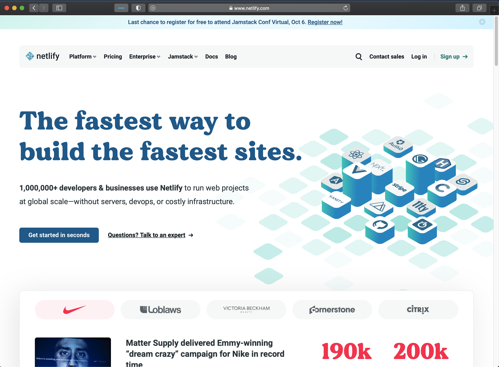
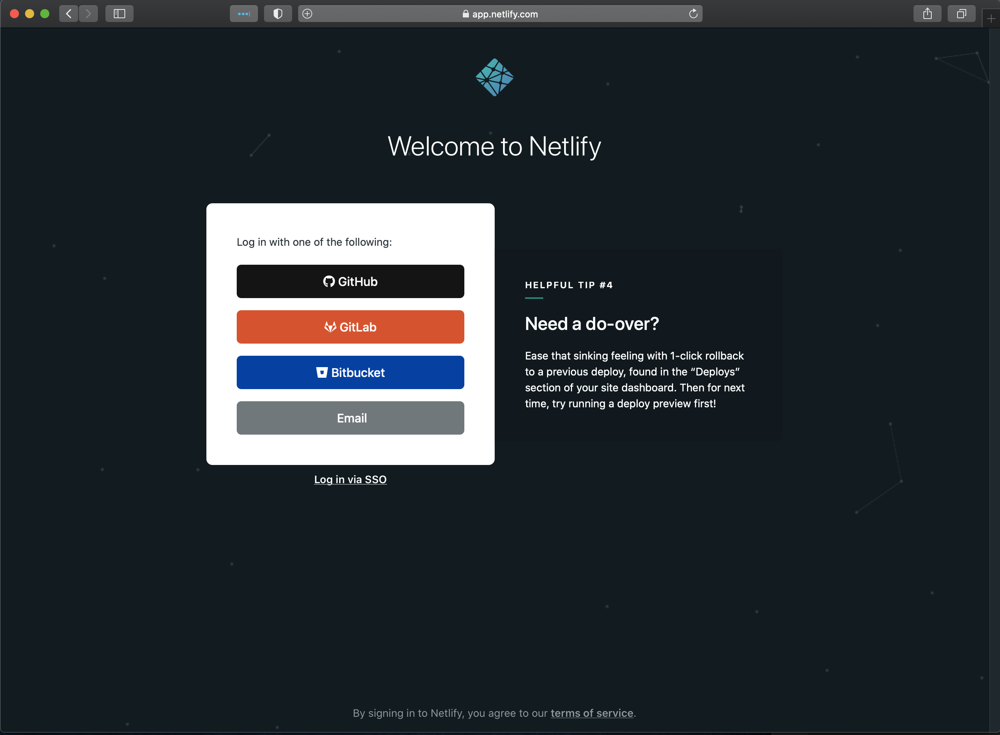
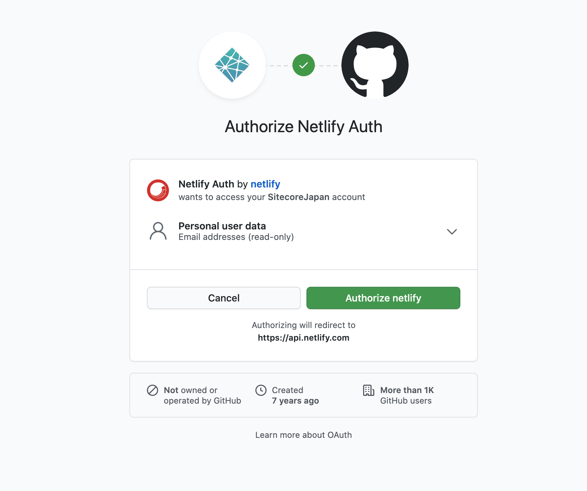
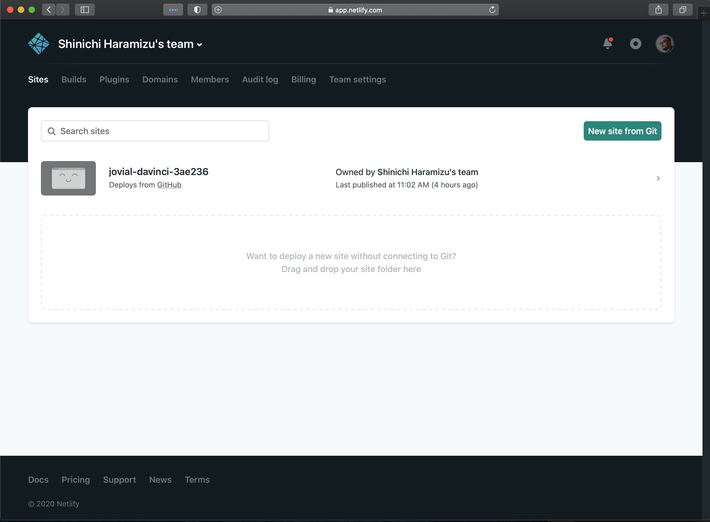

Netlify は、ホスティング環境を提供しており、標準で CDN が搭載されているなど非常に便利なホスティング環境です。

## 無料なのに非常に強力

基本的には静的サイトのホスティングに関しては簡単にできるようになっており、Docusaurus のように Build の手続きが必要なものも対応しています。Starter でもそれなりの使える形となっています。

* [Netlify 価格構成](https://www.netlify.com/pricing/)

私は以下のような条件なので、無料で使っている形です（ 2020年10月9日現在 ）

* Git との連携 ( GitHub のプライベートリポジトリも対応 )
* サイトプレビュー機能（ステージング環境も簡単に作れる）
* 一人で利用（とはいえ GitHub のリポジトリを共有してしまうことも可能）
* 帯域幅 100GB / 月（そこまでトラフィックはない） 
* Build の時間 300分 / 月（これもそこまで使わない）
* フォーム機能（まだ使ってない）
* CDN （ Global Edge deployments )

個人の環境であれば、上記の条件で十分賄うことができると思います。

## アカウントの作成

アカウントの作成は非常に簡単にできます。今回、私は GitHub のアカウントと紐づけて、GitHub のリポジトリと連携するような構成にしました。もちろん、他のソースコード管理ツールとも連携できるようになっています。

実際に連携させる際の画面は以下のようになります。

ログインをすると、サイト一覧が表示されます（以下の参考画面は、すでに１つサイトが登録されている状況です）。

ログインができたら、早速次のステップとしてサイトを追加しましょう。

## 関連情報

* [Netlify 公式サイト](https://www.netlify.com/)
* [Netlify 価格構成](https://www.netlify.com/pricing/)
