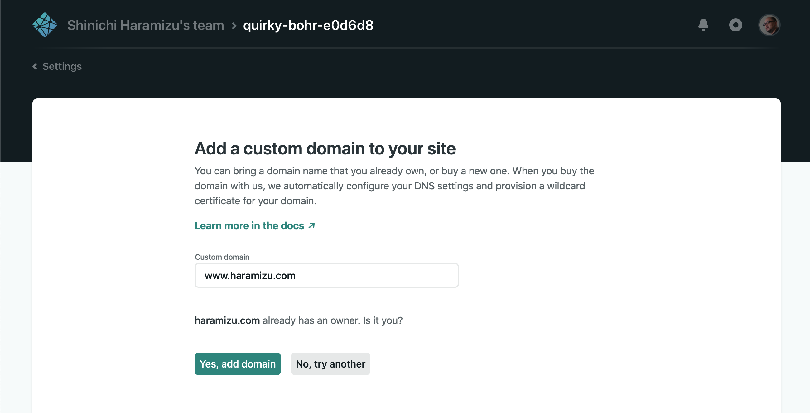
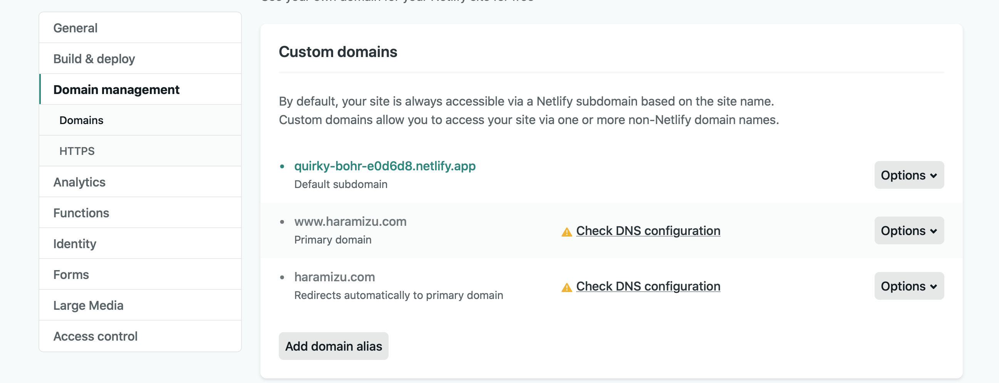

Netlify はホスティングができるサービスになっています。
ページはただいま作成中。

## アカウントの作成

GitHub のアカウントと連携させる

## サイトの作成


## ドメインの設定





Check DNS Configuration を立ち上げる

DNS の設定が表示されます


```
dns1.p01.nsone.net
dns2.p01.nsone.net
dns3.p01.nsone.net
dns4.p01.nsone.net
```

